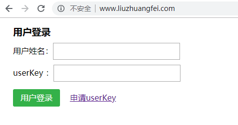
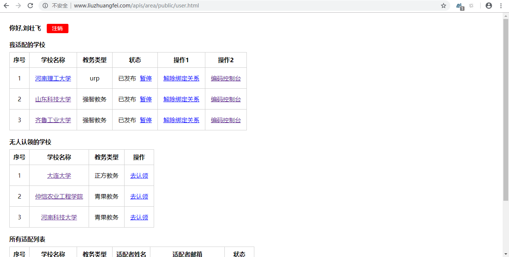
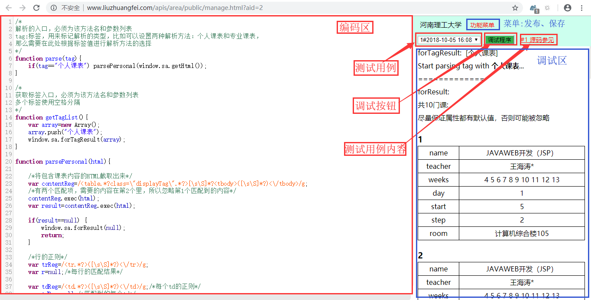

# CourseAdapter
适配平台是什么？简单来说，它是一组接口以及封装好的一些组件，使用它可以快速解析各个高校的课程，提供的功能有以下几点：

- 根据学校名称或教务类型获取教务url、课程解析函数（Js）等相关信息
- 获取页面源码
- 通过Js解析出课程集合
- 申请适配（上传源码）

## 注意事项

**在使用本平台前必须获得开发者的授权,违者必究!**

## 目录

- [申请授权流程](#申请授权流程)
    - [免费方式](#免费方式)
    - [付费方式](#付费方式)
    - [试用方式](#试用方式)

- [申请成为适配者](#申请成为适配者)

- [适配流程](#适配流程)
    - [登录](#适配流程)
    - [个人中心](#个人中心)
    - [编码控制台](#编码控制台)

- [解析API](#解析API)
    - [基本方法](#基本方法)
    - [经典案例](#经典案例)

- [授权列表](#授权列表)

## 效果展示

可以直接搜索学校获得支持的学校列表，然后进入相应的URL，登录个人教务账号后点击解析按钮，直接可以解析出课程集合，案例参考以下软件

[怪兽课表](https://www.coolapk.com/apk/com.zhuangfei.hputimetable)

该平台也可以和课表控件相结合，具体的看该控件的使用文档

[课表控件](https://github.com/zfman/TimetableView)

## 申请授权流程

以邮件的形式向作者邮箱`119360556@qq.com`提出申请

邮件主题:申请课程适配授权-xxx

邮件内容请注明：

- 项目名称（有链接的话提供链接）
- 申请者姓名
- 选择的授权方式

我会在两天之内回复，如果你选择的是免费方式，那么你需要在一个月内完成适配任务，并且在适配完成后通知作者`119360556@qq.com`并提供你的userKey

如果你的申请通过的话，我会将你的项目加入到授权列表中

Ps:xxx是姓名

以下三种授权方式任选其一即可，如果你不确定这个功能是否好用的话，你可以无条件免费试用一周，但是需要事先向开发者邮件申请，一周后继续使用的话必须获得授权

### 免费方式

在本平台上适配**20所**学校，教务类型不得低于**3种**，限时**一个月**完成适配任务

> 教务类型相同的学校解析策略基本一致，难度较低，只需要把测试用例运行一遍，一般情况下几秒就可以解决了，所以只需要写5种解析策略就可以了，限时一个月

### 付费方式

资费为**120 元/年**，向作者邮件申请后会得到后续流程

### 试用方式

没有任何附加条件，但是必须向作者申请，仅仅作为记录

不管选择哪种方式，都必须向作者报备，申请通过后作者会将接入文档回复给你

## 申请成为适配者

无门槛申请，但是如果申请后长时间不适配则可能被取消适配资格!

> 随着用户提交的源码增多，以我一人之力肯定不能适配这么多的学校，所以邀请开发者参与适配。适配用到的语言是Js，但是逻辑都很简单，就是正则匹配到结果后返回，不会的话也没问题，我相信你可以通过我的文档以及各种各样的的案例学会它

那么如何适配呢？

- 发送邮件至开发者邮箱`1193600556@qq.com`
- 邮件主题:申请课程适配账户-用户姓名,如：`申请课程适配账户-刘壮飞`
- 邮件内容:可写可不写，写的信息会作为备注

这就Ok了？没错!

只要你的名字不是瞎编的，肯定会通过的，作者会在两日之内将userKey(32位串)发送到你的邮箱,然后登录[全国大学生课程适配平台-官网](http://www.liuzhuangfei.com/)，使用你的姓名和userKey即可登录

## 适配流程

### 1.登录[全国大学生课程适配平台-官网](http://www.liuzhuangfei.com/)



### 2.个人中心

登录成功后会跳转到个人中心页面，个人中心页面分为以下几个部分：

- 我适配的学校 ： 用户与学校建立绑定关系后会显示在这个区域，可以暂停发布、解除绑定关系、前往编码控制台
- 无人认领的学校 ： 经管理员筛选后且未与用户建立绑定关系的学校会显示在这个区域，点击去认领即建立绑定关系
- 所有适配列表 ： 所有与用户建立绑定关系的学校会显示在这个区域



### 3.编码控制台

顶栏是按钮区，依次为模式选项按钮组、运行选项按钮组、本地记录按钮组

模式选项按钮组：

- 编码模式：两列，左侧为源码区，右侧是编码区，比例4：6
- 标准模式：三列，左侧是源码区，中间是编码区，右侧是调试区，比例3：4：3
- 调试模式：两列，左侧是编码区，右侧是调试区，比例6：4

运行选项按钮组：

- 运行程序：调试面板会显示解析的结果，用作调试
- 发布程序：保存并发布，发布后对用户可见

本地记录按钮组：

- 暂存本地：暂时存到浏览器内
- 恢复最近的本地记录：从本地恢复最近保存的记录



进入编码控制台后，首先在源码区选择一个源码作为测试用例，然后就可以开始解析了...

## 解析API

### 基本方法

在编码控制台编写解析函数时，你可以使用Javascript、Jquery-2.0.0

开始适配时，编码控制台会自动创建三个函数，`parse(tag)`、`getTagList()`这两个函数的定义不能修改,因为它们是入口函数

```
/*
注意事项:
1.不得使用//来注释
2.授权作者发布
3.保留你的署名权
4.出现问题请联系作者QQ:1193600556
*/

/*
解析的入口，必须为该方法名和参数列表
tag:标签,用来标记解析的类型.
比如可以设置两种解析方法：个人课表和专业课表,那么需要在此处根据标签值进行解析方法的选择
获取输入源码:window.sa.getHtml()
*/
function parse(tag){
   if(tag=="个人课表") parsePersonal(window.sa.getHtml());
}

/*
获取标签入口,必须为该方法名和参数列表
*/
function getTagList(){
   var array=new Array();
   array.push("个人课表");
   window.sa.forTagResult(array);
}

/*
解析个人课表.
返回结果使用:window.sa.forResult(_getResult(totalArray))
未发现匹配:window.sa.forResult(null)
创建一个课程项:var itemArray=_build(name,teacher,weeks,day,start,step,room);
参数均为String,weeks:以空格分隔每个周次,如1 3 5 7
*/
function parsePersonal(html){
   /*二维数组,保存结果*/
   var totalArray=new Array();

   /*完善此处代码*/

   window.sa.forResult(_getResult(totalArray));
}
```

在解析时，可以使用`Javascript`、`Jquery-2.0.0`以及以下函数：

- `window.sa.getHtml()`:返回值是页面源码，解析也是以此作为输入
- `window.sa.forTagResult(array)`:将标签数组返回给Android
- `window.sa.forResult(_getResult(totalArray))`：将结果totalArray返回给Android
- `window.sa.info('msg')`:显示一个Info级别的Toast
- `window.sa.warning('msg')`:显示一个Warn级别的Toast
- `window.sa.error('msg')`:显示一个Error级别的Toast
- `_build(name,teacher,weeks,day,start,step,room)`：构建一个课程项，该函数返回一个数组
- `_getResult(totalArray)`:将totalArray转化为字符串

### 经典案例

河南理工大学源码参见[13e431ca504e406f09a304229b32b96f.txt](http://www.liuzhuangfei.com/apis/area/public/htmlsource.html?filename=13e431ca504e406f09a304229b32b96f.txt)

```java
/*
解析的入口，必须为该方法名和参数列表
tag:标签，用来标记解析的类型，比如可以设置两种解析方法：个人课表和专业课表，
那么需要在此处根据标签值进行解析方法的选择
*/
function parse(tag){
	if(tag=="个人课表") parsePersonal(window.sa.getHtml());
}

/*
获取标签入口，必须为该方法名和参数列表
*/
function getTagList(){
	var array=new Array();
	array.push("个人课表");
	window.sa.forTagResult(array);
}

function parsePersonal(html){

	/*将包含课表内容的HTML截取出来*/
	var contentReg=/<table.*?class=\"displayTag\".*?>[\s\S]*?<tbody>([\s\S]*?)<\/tbody>/g;
	/*有两个匹配项，需要的内容在第2个里，所以忽略第1个匹配到的内容*/
	contentReg.exec(html);
	var result=contentReg.exec(html);

	if(result==null) {
		window.sa.forResult(null);
		return;
	}

	/*行的正则*/
	var trReg=/<tr.*?>([\s\S]*?)<\/tr>/g;
	var r=null;/*每行的匹配结果*/

	var tdReg=/<td.*?>([\s\S]*?)<\/td>/g;/*每个td的正则*/
	var tdRes=null;/*匹配到的每个td*/
	var preArray=null;/*上次匹配到的一行（包含课程名的行）*/
	var totalArray=new Array();/*二维数组，保存结果*/

	/*循环匹配*/
	while((r=trReg.exec(result[1]))!=null){
		var tr=r[1];/*每行*/
		var array=new Array();/*保存每个td的值*/
		while((tdRes=tdReg.exec(tr))!=null){
			var val=tdRes[1].replace(/\s+/g,"");
			val=val.replace(/&nbsp;/g,"");
			val=val.replace(/\(.*?\)/g,"");
			array.push(val);
		}
		if(array.length>8){
			var a=_build(array[2],array[7],getWeekStr(array[11]),array[12],getStart(array[13]),array[14],array[16]+array[17]);
			totalArray.push(a);
			preArray=a;
		}else{
			var a=_build(preArray[0],preArray[1],getWeekStr(array[0]),array[1],getStart(array[2]),array[3],array[5]+array[6]);
			totalArray.push(a);
		}
	}

	window.sa.forResult(_getResult(totalArray));
}

function getStart(startStr){
	if(startStr=="第一大节") return "1";
	if(startStr=="第二大节") return "3";
	if(startStr=="第三大节") return "5";
	if(startStr=="第四大节") return "7";
	if(startStr=="第五大节") return "9";
	if(startStr=="第六大节") return "11";
	return "";
}

/*
将weeks解析为可理解的周次，如1,3-5周上转化为:1 3 4 5
*/
function getWeekStr(weeks){
/*去中文*/
	var weeksReg=new RegExp("[^\\d-\\,]","g");
	var newWeeks=weeks.replace(weeksReg,"");
	var newWeeksStr="";/*结果*/

	/*如果存在逗号*/
	if(newWeeks.indexOf(",")!=-1){
		var splitArray=newWeeks.split(",");
		for(var i=0;i<splitArray.length;i++){
			newWeeksStr+=splitWeeks(splitArray[i]);
		}
	}else newWeeksStr=splitWeeks(newWeeks);
	return newWeeksStr;
}

/*
对周次去掉逗号后的处理：去掉横杠
*/
function splitWeeks(str){
	var res="";
	if(str.indexOf("-")!=-1){
		var splitArray3=str.split("-");
		for(var start=parseInt(splitArray3[0]);start<=parseInt(splitArray3[1]);start++){
			res=res+start+" ";
		}
	}else{
		res=res+str+" ";
	}
	return res;
}
```

**运行结果**

在控制台上的运行结果如下，如果课程的关键信息(day、start、step、weeks)为空的话就会被过滤掉，这一点要注意到

```
forTagResult:  [个人课表]
Start parsing tag with 个人课表...
=============
forResult:
共22门课(实际运行中课程信息不全的会被忽略):
1
name	热工基础与应用
teacher	盛伟*
weeks	11 12 13 14 15 16
day	3
start	3
step	2
room	机械综合楼305

2
name	热工基础与应用
teacher	盛伟*
weeks	10 11 12 13 14 15 16
day	4
start	9
step	2
room	机械综合楼305


3
name	电路史诗
teacher	韩素敏*
weeks
day
start
step
room


4
name	人机工程学
teacher	任卫红*
weeks	10 11 12 13 14 15 16
day	4
start	1
step	2
room	机械综合楼305


5
name	人机工程学
teacher	任卫红*
weeks	10 11 12 13 14 15 16
day	1
start	9
step	2
room	理化综合楼303


6
name	液压与气压传动
teacher	刘俊利*
weeks	10 11 12 13 14 15 16
day	1
start	1
step	2
room	3号教学楼3501


7
name	液压与气压传动
teacher	刘俊利*
weeks	10 11 12 13 14 15 16
day	5
start	1
step	2
room	理化综合楼305


8
name	机械设计课程设计
teacher	张会端*
weeks
day
start
step
room


9
name	电工电子技术训练b
teacher	史祥翠*
weeks
day
start
step
room


10
name	可编程控制器原理
teacher	陈春朝*
weeks	4 5 6 7 8 9 10
day	3
start	3
step	2
room	2号教学楼2310


11
name	可编程控制器原理
teacher	陈春朝*
weeks	4 5 6 7 8 9
day	5
start	3
step	2
room	2号教学楼2210


12
name	机械工程控制基础
teacher	高国富*
weeks	6 7 10 11 12 13 14 15 16
day	2
start	9
step	2
room	机械综合楼102


13
name	机械工程控制基础
teacher	高国富*
weeks	6 7 10 11 12 13 14 15 16
day	4
start	5
step	2
room	机械综合楼102


14
name	形势与政策-4
teacher	王威*
weeks	10
day	6
start	5
step	4
room	理化综合楼205


15
name	机械设计a
teacher	张会端*
weeks	1 2 3 4 5 6 7 10 11 12 13 14 15
day	1
start	3
step	2
room	3号教学楼3505


16
name	机械设计a
teacher	张会端*
weeks	13 14 15
day	2
start	1
step	2
room	理化综合楼303


17
name	机械设计a
teacher	张会端*
weeks	1 2 3 4 5 6 7 10 11 12 13 14 15
day	3
start	1
step	2
room	理化综合楼303


18
name	毛泽东思想和中国特色社会主义理论体系概论
teacher	成小明*
weeks	1 2 3 4 5 6 7 10 11
day	1
start	5
step	2
room	机械综合楼305


19
name	毛泽东思想和中国特色社会主义理论体系概论
teacher	成小明*
weeks	1 2 3 4 5 6 7 10 11
day	3
start	5
step	2
room	机械综合楼305


20
name	毛泽东思想和中国特色社会主义理论体系概论
teacher	成小明*
weeks	1 2 3 4 5 6 7 10 11 12
day	5
start	5
step	2
room	机械综合楼305


21
name	极限配合与测量技术基础
teacher	赵明利*
weeks	6 7 10 11 12 13 14 15 16
day	2
start	3
step	2
room	2号教学楼2405


22
name	极限配合与测量技术基础
teacher	赵明利*
weeks	6 7 10 11 12 13 14 15 16
day	4
start	3
step	2
room	2号教学楼2405
```

## 授权列表

> 在此列出的为作者授权使用“全国大学生适配系统”的开发者列表，未列出的名单禁止借助任何手段使用本平台提供的服务

| 项目名称 | 申请者 | 授权日期 | 完成日期 |授权状态
| ------ | ------ | ------ | ------ |------ |
| [怪兽课表](https://www.coolapk.com/apk/com.zhuangfei.hputimetable) | [刘壮飞](https://github.com/zfman) | 2018/10/18 | --- |已授权|

任何问题可以联系开发者邮箱`1193600556@qq.com`